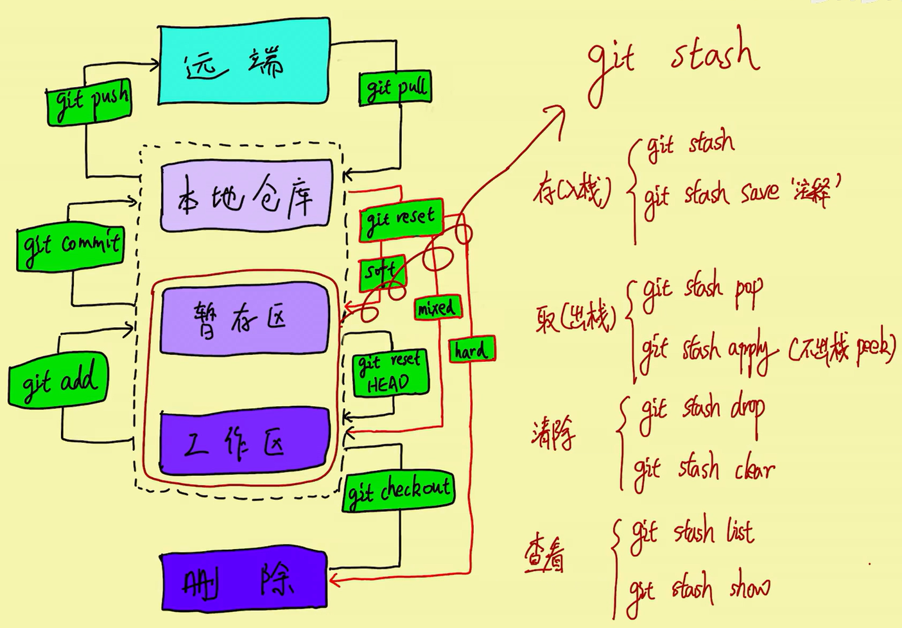

### 本地创建新仓库，链接到远程服务器，提交

```shell
cd 123/
git init
git remote add origin http://...../123.git
git branch -M main
git add .
git commit -m "first commit"
git push -u origin main
```

### git pull

```shell
#拉去远程所有分支->本地仓库
git pull origin
#拉取远程中某一个分支->本地
git pull origin <远程分支>:<本地分支>
```

### git checkout

```shell
#切换分支，切换时，路径下面的内容会跟随变化（包括删除和修改）
git checkout <分支名称>
```

### git stash

#将当前更改的代码，暂存到stash，并将当前分支下的内容，恢复到最新的一次commit
#注意，新创建的文件未被追踪，需要先git add进去
git add 文件
git stash push
#或者
git stash push -m "描述"
#暂存后切换分支,不会丢失stash内的内容，使用：
git checkout <分支名词>

```shell
#查看stash内的列表
git stash list
#将暂存的stash恢复到当前工作区
git stash pop
#stash是所有分支共享的栈，恢复指定的stash，使用：
git stash apply stash@{数字}
```

### git restore

```shell
#由于放弃对文件的修改，前提是：文件被追踪
git restore 文件1 文件2
#取消暂存
git restore --staged 文件1 文件2
#所有文件，则输入.
```

### git reset

```shell
#由于撤销add或者commit

#--soft
#执行完commit后，想撤回commit。仅仅是撤回commit操作，您写的代码仍然保留。
git reset --soft HEAD^

#--mixed，这个为默认参数。
#撤销commit且撤销add。
git reset --mixed HEAD^ 和 git reset HEAD^ 效果是一样的。

#--hard
#删除工作空间改动代码，撤销commit，撤销git add . 
#注意完成这个操作后，就恢复到了上一次的commit状态。
git reset --hard HEAD^
```


