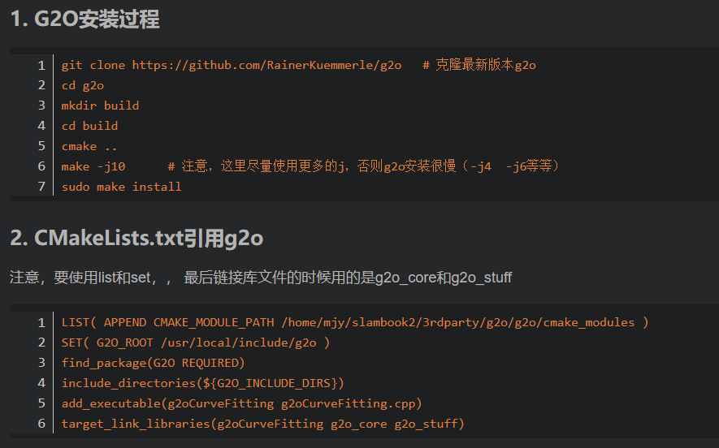
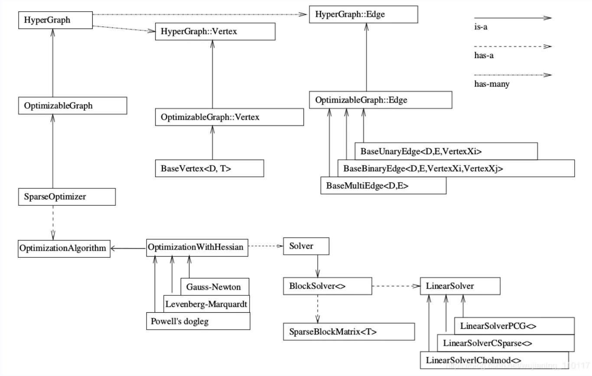

### .vscode

#### .vscode/launch.json

```cpp
{
    "version": "0.2.0",
    "configurations": [
        {
            "name": "(gdb) 启动",
            "type": "cppdbg",
            "request": "launch",
            "program": "${workspaceFolder}/build/ch2/useHello",
            "args": [],
            "stopAtEntry": false,
            "cwd": "${fileDirname}",
            "environment": [],
            "externalConsole": false,
            "MIMode": "gdb",
            "setupCommands": [
                {
                    "description": "为 gdb 启用整齐打印",
                    "text": "-enable-pretty-printing",
                    "ignoreFailures": true
                },
                {
                    "description": "将反汇编风格设置为 Intel",
                    "text": "-gdb-set disassembly-flavor intel",
                    "ignoreFailures": true
                }
            ],
            "preLaunchTask": "build ch2",
        }
    ]
}
```

#### .vscode/tasks.json

```cpp
{
    "version": "2.0.0",
    "tasks": [
        {
            "label": "cmake the ch2",
            "type": "shell",
            "command": "cmake",
            "args": [
                "../../ch2/"
            ],
            "options": {
                "cwd": "${workspaceFolder}/build/ch2/"
            },
            "group": "build",
            
            "problemMatcher": "$gcc"
        },

        {
            "label": "make the ch2",
            "type": "shell",
            "command": "make",
            "args": [

            ],
            "options": {
                "cwd": "${workspaceFolder}/build/ch2/"
            },
            "group": "build",
            "problemMatcher": "$gcc"
        },

        {
            "label": "build ch2",
            "dependsOn":[
                "cmake the ch2",
                "make the ch2"
            ]
        }
    ]
}
```


### cmake基本语法

```cmake
# 声明要求的 cmake 最低版本
cmake_minimum_required(VERSION 2.8)
# 声明一个 cmake 工程
project(HelloSLAM)
# 设置编译模式
set(CMAKE_BUILD_TYPE "Debug")

# 添加一个可执行程序
# 语法：add_executable( 程序名 源代码文件 ）

# 自定义生成hello库
add_library(hello libHelloSLAM.cpp)
# 自定义生成hello共享库
add_library(hello_shared SHARED libHelloSLAM.cpp)
# 添加可执行程序调用hello库中函数
add_executable(useHello useHello.cpp)
# 将hello库文件链接到可执行程序上
target_link_libraries(useHello hello_shared)

#添加子工程
add_subdirectory(visualizeGeometry)
add_subdirectory(examples)

```


### 常用库包含写法

```cmake
#Pangolin
find_package( Pangolin )
include_directories( ${Pangolin_INCLUDE_DIRS} )
链接库：${Pangolin_LIBRARIES}

#Sophus
find_package(Sophus REQUIRED)
include_directories(${Sophus_INCLUDE_DIRS})
链接库：Sophus::Sophus

# OpenCV
find_package(OpenCV 4 REQUIRED)#使用4版本就加上4
include_directories(${OpenCV_INCLUDE_DIRS})
链接库：${OpenCV_LIBS}

# Ceres
find_package(Ceres 2 REQUIRED)#使用2.0.0版本就加上2
include_directories(${CERES_INCLUDE_DIRS})
链接库：${CERES_LIBRARIES}

# Eigen
include_directories("/usr/include/eigen3")

#g2o
LIST( APPEND CMAKE_MODULE_PATH /home/ywz/3rdparty/g2o/cmake_modules )
set(G2O_ROOT /usr/local/include/g2o)
find_package(G2O REQUIRED)
include_directories(${G2O_INCLUDE_DIRS})
#g2o稀疏依赖库csparse		及头文件<cs.h>
LIST(APPEND CMAKE_MODULE_PATH ${PROJECT_SOURCE_DIR}/cmake)#放置文件FindCSparse.cmake
Find_Package(CSparse REQUIRED)
include_directories(${CSPARSE_INCLUDE_DIR})
链接库：cxsparse
#g2o库名，超级多，使用时打印全部变量自己查阅
set(G2O_LIBS ${G2O_STUFF_LIBRARY} ${G2O_CORE_LIBRARY} cxsparse
 	${G2O_SOLVER_CSPARSE_EXTENSION} ${G2O_TYPES_SLAM3D} ${G2O_SOLVER_CHOLMOD})
链接库：${G2O_LIBS}


#SSE指令集，比如uint_32的1位数
#add_definitions("-DENABLE_SSE")
#set(CMAKE_CXX_FLAGS "-std=c++11 -O2 ${SSE_FLAGS} -msse4")


#找不到库，在前面加一句
set(ABC_DIR /home/ywz/3rdparty/ABC/build)
find_package(ABC REQUIRED)

#输出全部变量
get_cmake_property(_variableNames VARIABLES)
foreach (_variableName ${_variableNames})
    message(STATUS "${_variableName}=${${_variableName}}")
endforeach()
```

[别人写的笔记1](https://blog.csdn.net/weixin_42447403/article/details/121263655)    [笔记2](https://blog.csdn.net/qq_41253960/article/details/121265978)

### FindCSparse.cmake

```cmake
# Look for csparse; note the difference in the directory specifications!
FIND_PATH(CSPARSE_INCLUDE_DIR NAMES cs.h
  PATHS
  /usr/include/suitesparse
  /usr/include
  /opt/local/include
  /usr/local/include
  /sw/include
  /usr/include/ufsparse
  /opt/local/include/ufsparse
  /usr/local/include/ufsparse
  /sw/include/ufsparse
  )

FIND_LIBRARY(CSPARSE_LIBRARY NAMES cxsparse
  PATHS
  /usr/lib
  /usr/local/lib
  /opt/local/lib
  /sw/lib
  )

include(FindPackageHandleStandardArgs)
find_package_handle_standard_args(CSPARSE DEFAULT_MSG
  CSPARSE_INCLUDE_DIR CSPARSE_LIBRARY)

```


### linux命令行

```
输入apt-cache可以查看这个命令的用法
showpkg 包名称 显示一个具体包的信息
search 搜索信息 根据信息搜索包；
pkgnames 从头开始的部分名称列出名称头部匹配的软件。
使用指令apt-cache showpkg IPython显示了已经安装的ipython package的有关信息。
使用命令apt-cache pkgnames python3-num列出了以python3-num开头的包。（注意，这些是搜索来自网络的缓存，而不是本地包信息）
使用apt-cache search ipython3指令，搜索和这个名字有关的包。
下边的搜索类似。注意，search搜索并不要求包名匹配，如果包描述中有相关信息，也能搜索到。

更新cmake版本 sudo pip install --upgrade cmake==3.22.2

找不到/usr/local/lib下的so文件
/etc/ld.so.conf文本文件里添加/usr/local/lib，然后sudo ldconfig刷新一下
```


### ceres安装

```cmake
#安装二进制，下面语句直接安装cartographer库_ros以及ceres及依赖
#ceres1.13.0
sudo apt install cartographer*
```

[官网安装2.0.0版本（源码方式）](http://www.ceres-solver.org/installation.html#linux)


### g2o安装

必须先安装所有依赖，缺少依赖的话，相关g2o模块就不会安装，且不会提示！！！




### ceres语法

#### 1.自动求导

```cpp
#include "ceres/ceres.h"
class CeresType {
public:
  CeresType(){}
	
  //以模板重载()运算符，ceres会自动调用，必须使用模板，以方便ceres调用Jet数据结构自动求导
  template<typename T>
  bool operator()(const T *const camera,
                  const T *const point,
                  T *residuals) const {
    residuals[0] = 。。。;
    residuals[1] = 。。。;
    return true;
  }
  成员变量;
}
ceres::Problem problem;
ceres::CostFunction *cost_function;
cost_function=new ceres::AutoDiffCostFunction<CeresType, 2, 9, 3>(
  new CeresType(_1,_1));//指定维度
problem.AddResidualBlock(cost_function, loss_function, camera, point);

ceres::Solver::Options options;
options.linear_solver_type = ceres::LinearSolverType::SPARSE_SCHUR;
options.minimizer_progress_to_stdout = true;
ceres::Solver::Summary summary;
ceres::Solve(options, &problem, &summary);
std::cout << summary.FullReport() << "\n";
```

#### 2.数值求导

（当使用外部函数，如李代数时使用，因为ceres自动求导jet将无法控制） [链接](https://blog.csdn.net/zhuchao414259/article/details/115555823?spm=1001.2101.3001.6650.1&utm_medium=distribute.pc_relevant.none-task-blog-2%7Edefault%7ECTRLIST%7ERate-1.pc_relevant_antiscanv2&depth_1-utm_source=distribute.pc_relevant.none-task-blog-2%7Edefault%7ECTRLIST%7ERate-1.pc_relevant_antiscanv2&utm_relevant_index=2)

```cpp
#include<Eigen/Eigen>
#include<Eigen/Core>
#include<ceres/ceres.h>
#include<sophus/se3.hpp>

//使用ceres数值求导方式，因为使用了Jet外部无法控制的函数(李代数)，NumericDiffCostFunction
class NumericDiffEdgeError{
public:
  	//初始化，略
    NumericDiffEdgeError(Eigen::Quaterniond& q,Eigen::Vector3d& t,Eigen::Matrix<double,6,6>&info_matrix):_Tij_1(q,t){
      	_info_sqrt=info_matrix.llt().matrixL();//信息矩阵的开方
    }
  	//xi、xj是六维李代数（"t",R)，此函数内修改residuals,可以使用李代数等复杂的函数
    bool operator()(const double* const xi,const double* const xj,double* residuals)const{
      	eij=_info_sqrt*eij;//信息矩阵的手动使用
        return true;
    }
    static ceres::CostFunction *Create(Eigen::Quaterniond&q,Eigen::Vector3d&t,
                                       Eigen::Matrix<double,6,6>&info_matrix) {
        return (new ceres::NumericDiffCostFunction<NumericDiffEdgeError, ceres::CENTRAL,6,6,6>(
            new NumericDiffEdgeError(q,t,info_matrix)));
    }
    Sophus::SE3d _Tij_1;
    Eigen::Matrix<double,6,6> _info_sqrt;
};

int main(int argc, char **argv) {
    unordered_map<int,double*> id_liepose;//double* 为6维李代数，前三维为"t"，后三维为旋转
    id_liepose[id]=lie_vertex;//把节点内存地址存入字典
    ceres::Problem problem;//ceres待求解对象
//添加误差项（约束）
  	problem.AddResidualBlock(NumericDiffEdgeError::Create(q,t,info_matrix),
                                   NULL,id_liepose[id1],id_liepose[id2]);

    ceres::Solver::Options options;
    options.minimizer_progress_to_stdout = true;
    ceres::Solver::Summary summary;
    ceres::Solve(options, &problem, &summary);
    std::cout << summary.FullReport() << "\n";
    return 0;
}

```

#### 3.解析求导

（手动求导公式)


### g2o语法



```cpp
#include <g2o/core/base_vertex.h>
#include <g2o/core/base_binary_edge.h>
#include <g2o/core/block_solver.h>
#include <g2o/core/optimization_algorithm_levenberg.h>
#include <g2o/solvers/csparse/linear_solver_csparse.h>
#include <g2o/core/robust_kernel_impl.h>

//继承基类节点并重写成员函数，相机位姿节点
class VertexPoseAndIntrinsics : public g2o::BaseVertex<9, PoseAndIntrinsics> {
public:
	virtual void setToOriginImpl() override {
  	_estimate = PoseAndIntrinsics();
  }
  virtual void oplusImpl(const double *update) override{
  	//更新_estimate(类型是PoseAndIntrinsics)
  }
  
  virtual bool read(istream &in) {}
  virtual bool write(ostream &out) const {}
}
//同理，定义3D特征点的节点
class VertexPoint : public g2o::BaseVertex<3, Vector3d>{

}
//定义边，_error的维度2，_measurement存储类型Vector2d，连接两种顶点
class EdgeProjection:
public g2o::BaseBinaryEdge<2, Vector2d, VertexPoseAndIntrinsics, VertexPoint> {
public:
  EIGEN_MAKE_ALIGNED_OPERATOR_NEW;

  virtual void computeError() override {
    _error[0]=。。。;
    _error[1]=。。。;
  }
  // 计算雅可比矩阵，不写则自动求导
  virtual void linearizeOplus() override {
    _jacobianOplusXi[0] = 
    _jacobianOplusXi[1] = 
    _jacobianOplusXi[2] = 
  }

  virtual bool read(istream &in) {}
  virtual bool write(ostream &out) const {}
};

// pose dimension 9, landmark is 3
typedef g2o::BlockSolver<g2o::BlockSolverTraits<9, 3>> BlockSolverType;
typedef g2o::LinearSolverCSparse<BlockSolverType::PoseMatrixType> LinearSolverType;
// use LM
auto solver = new g2o::OptimizationAlgorithmLevenberg(
g2o::make_unique<BlockSolverType>(g2o::make_unique<LinearSolverType>()));
g2o::SparseOptimizer optimizer;
optimizer.setAlgorithm(solver);
optimizer.setVerbose(true);

//添加节点类型1
VertexPoseAndIntrinsics *v = new VertexPoseAndIntrinsics();
v->setId(i);
v->setEstimate(PoseAndIntrinsics(camera));
optimizer.addVertex(v);
//添加节点类型2
VertexPoint *v = new VertexPoint();
v->setId(i);
v->setEstimate(Vector3d(point[0], point[1], point[2]));
optimizer.addVertex(v);

//添加边
EdgeProjection *edge = new EdgeProjection;
edge->setVertex(0, 连接节点1的指针);
edge->setVertex(1, 连接节点2的指针);
edge->setMeasurement(Vector2d(observations[2 * i + 0], observations[2 * i + 1]));
edge->setInformation(Matrix2d::Identity());
edge->setRobustKernel(new g2o::RobustKernelHuber());
optimizer.addEdge(edge);

//开始优化
optimizer.initializeOptimization();
optimizer.optimize(40);

//取出结果
v->estimate();
```

```cpp
//g2o求解位姿图
#include <g2o/types/slam3d/types_slam3d.h>
#include <g2o/core/block_solver.h>
#include <g2o/core/optimization_algorithm_levenberg.h>
#include <g2o/solvers/eigen/linear_solver_eigen.h>
// 设定g2o
typedef g2o::BlockSolver<g2o::BlockSolverTraits<6, 6>> BlockSolverType;
typedef g2o::LinearSolverEigen<BlockSolverType::PoseMatrixType> LinearSolverType;
auto solver = new g2o::OptimizationAlgorithmLevenberg(
g2o::make_unique<BlockSolverType>(g2o::make_unique<LinearSolverType>()));
g2o::SparseOptimizer optimizer;     // 图模型
optimizer.setAlgorithm(solver);   // 设置求解器
optimizer.setVerbose(true);       // 打开调试输出
// SE3 顶点
g2o::VertexSE3 *v = new g2o::VertexSE3();
// SE3-SE3 边
g2o::EdgeSE3 *e = new g2o::EdgeSE3();
```


