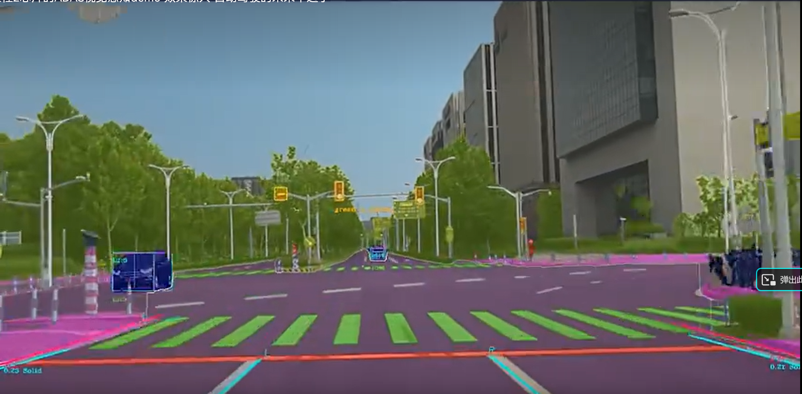
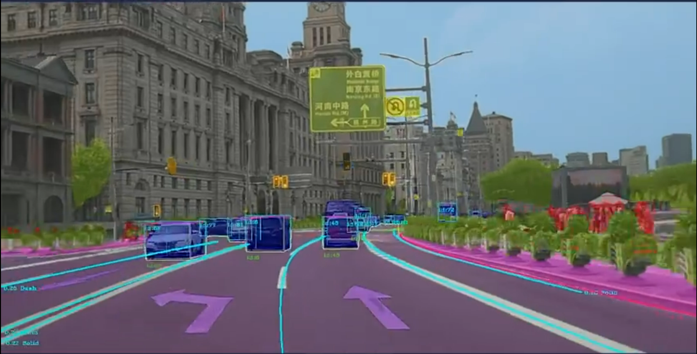
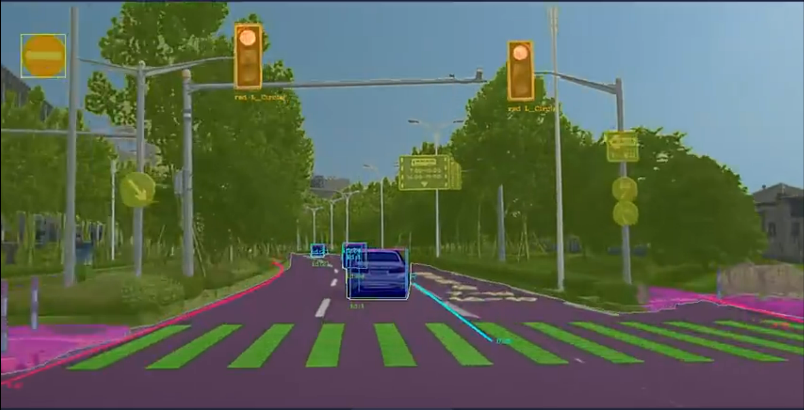
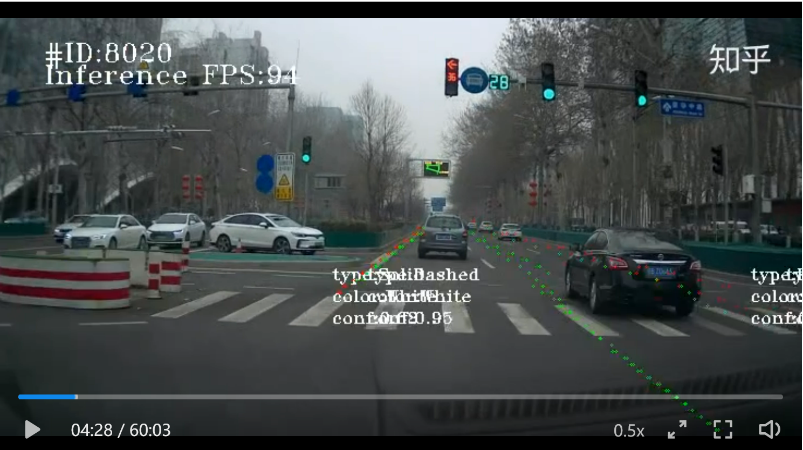
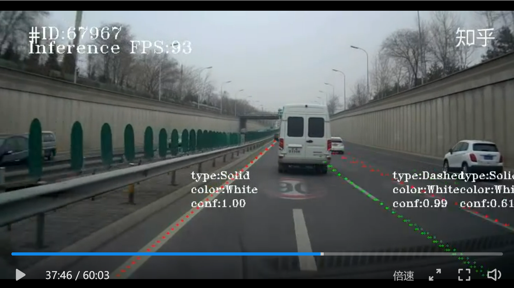

### 4.8入职前

#### 视频

[CVPR2022车道线检测演示](https://www.bilibili.com/video/BV1ki4y1m7kd/?spm_id_from=333.337.search-card.all.click&vd_source=4f69185a2f97398f5297328d7a913531) （未仔细研究，简单看后未懂）

特征车道空间构造（车道矩阵构造，SVD，低秩近似）

特征车道线性组合近似每个车道

生成车道候选（特征车道空间内聚类）

从中确定一组最佳车道

回归偏移细化车道

#### x车道线误检漏检情况-截图

- 对向车道的车道线（被车辆和水泥隔离带部分遮挡，未识别）

右侧第三根车道线（被车辆部分遮挡只露出一小段，未识别）

- 右侧路沿（部分被遮挡，未识别）

右侧路沿（远处被遮挡，未被遮挡的部分，只检测出近处部分）

弯道（输出的车道线曲线，与真实车道线形状不完全拟合）

近处无车道线参考时，远处出现车道线（远处车道线未识别）

续上，更近一些，依旧未识别

对向车道（被车辆遮挡，部分露出，未识别）

本车道（车道几乎被被车辆完全遮挡，未识别）

本车道（近处被遮挡，中远处未遮挡，未识别）

左2车道线（被车辆完全遮挡，未识别）

路口（转弯地面指引线，无遮挡，未识别）

近处无线，中远处才出现车道线，未识别

 续上，近处无线，中远处有线且被部分遮挡，未识别

#### x车道线误检漏检情况-归类

- **对向车道**：尤其在部分遮挡情况下，无识别/识别灵敏度低
- **遮挡**：被部分遮挡只露出线段，或被完全遮挡，会造成无识别

- **近处没有车道线**，在中远处才出现车道线：会造成无识别

- **路沿**：不明显时识别能力差

#### x车道线误检情况

曲线拟合问题

曲线远端偏离车道线（最右侧路沿的远处）

宽型车道线时，曲线拟合问题

被车辆遮挡，只露出部分车道线，曲线角度偏移

车道线远端未贴合，尤其在远处有车辆干涉情况下

车道线曲率变化，拟合曲线贴合性不好

#### x车道线误检分类

- **检测曲线贴合性不好**：当车道线曲折时，不能很好贴合
- **远处末端游离**：车道线远处末端，向远离中心线的方向弯曲时，往往会导致后续的车道线被隔离带或路边遮蔽，导致远处末端曲线拟合不好，发生游离
- **车道线部分线段可见时角度偏差**：当前方近处有车辆遮挡车道线，使得近处车道线只有根部短距离可见，识别拟合的车道曲线，角度与真实角度有较大偏差
- **宽型车道线拟合问题**：当车道线较宽时，可能会导致车道线识别在近处和远处，在宽型车道线的两侧拟合，而不是都以左侧/右侧/中心进行拟合，产生拟合差异

#### 车道线检测标注错误

[来自知乎视频](https://www.zhihu.com/zvideo/1394243288564670464?utm_source=wechat_session&utm_medium=social&utm_oi=1524026349157486592)

遮挡

闪烁：下面的画面在相邻时间内，多次闪烁

路口：刚过路口，车道线刚露出一点，误识别为实线（只持续了一点时间，就不再出现）

闪烁：一闪而过

多检测：多检测出来线

遮挡：右2车道线，被遮挡，线型错误

路口：正在过路口（多检测出线，线位置错误，线型错误）

路侧设施误检测：路沿左侧，多检测出实线

路口：正在过路口，多检测出线，线型错误

遮挡，闪烁：右车道线被遮挡，短时间内多次改变线型

路口：刚结束左转弯，线型错误

位于画面中心时线型错误：双黄实线集中在画面中心时，线型错误，当不在画面中心，不再错误

线型错误：单黄虚线

多检测：车道线不明显，多检测出线

线型错误：车道线磨损，线型错误

线型错误：车流密集时，车道线未遮挡，也误识别线型

路面标志误检测：路面有杂七杂八的标志时，多检测出线，线型错误

路面标志误检测：纵向减速标线，多检测出虚线

多检测：多检测出线

线型错误：地面有标志干扰，线型识别错误

线型错误：地面有标志干扰

路沿线型错误：左侧路沿，线型错误

线型错误

路沿线型错误：隔离带路沿，线型错误

线型错误，阴影：有阴影，线型错误

线型错误，遮挡：车辆遮挡，线型错误

地面标志误识别：地面标志被误识别为车道线

闪烁：线型反复跳变

线型错误

路侧误识别：路侧花坛误识别

斑马线误识别，线型错误：斑马线被误识别为虚线

颜色识别错误

#### [Open DRIVE格式](https://odrviewer.io/)

涉及概念：

- section：沿道路方向，分段
- lane：道路横向剖面上，以顺逆行分割线为0，左右车道线分别为正/负的递增序号
- junction：路口概念，路口没有线，则以虚拟线连接道路，以示道路连通
- tracking：*Tracking的坐标系是ST，S代表车道Reference Line起点的偏移量，T代表基于Reference Line的横向偏移量。*

拓扑地图：

### 4.17

#### toponet驾驶场景的拓扑推理

TopoNet是一种驾驶场景拓扑推理系统，用于分析自动驾驶汽车的环境并理解车辆周围的驾驶场景。它基于一种图论方法，可以将环境中的各种对象和车辆的运动状态表示为一个拓扑图，从而推断出车辆的位置、速度和可行驶路径等信息。

具体来说，TopoNet使用传感器（例如激光雷达和相机）收集车辆周围的数据，并将这些数据转换成图形表示。这个图形表示包括节点和边，其中节点代表车辆和其他物体（例如行人、建筑物、路标等），边表示它们之间的关系，例如距离、速度和方向等。

通过对这个拓扑图进行分析，TopoNet可以识别不同的驾驶场景，例如直行、左转、右转、超车等。它还可以预测其他车辆和行人的运动轨迹，以及识别交通标志和路线指示。

总的来说，TopoNet的驾驶场景拓扑推理系统为自动驾驶汽车提供了一种高效的方式来理解和响应环境中的各种驾驶情况，并为安全驾驶提供了重要支持。

### 4.23

视觉感知车道线区域，从高精地图内做section的合并，以及切分，可视化。

#### Apollo/pnc_map

##### modules\map\pnc_map\route_segments.h

基于vector\<LaneSegment\>进行操作，LaneSegment又分为两个不同命名空间内的不同类型，但已通过重载进行适配。

- Stitch函数：拼接RouteSegments即vector\<LaneSegment\>

- Shrink函数：作用是将`RouteSegments`中的车道分段缩小到指定的长度。具体实现逻辑如下：
  1. 如果`RouteSegments`中的车道分段总长度小于等于指定长度，则直接返回。
  2. 否则，从`RouteSegments`的起点开始，依次计算每个车道分段的长度，直到累计长度大于指定长度。此时，将当前车道分段的起点向后移动，使其与累计长度对应的位置重合。
  3. 重复步骤2，直到`RouteSegments`中的所有车道分段都被缩小到指定长度为止。

- 涉及的部分数据类型：routing::LaneSegment、routing::LaneWaypoint、routing::ChangeLaneType以及在hdmap命名空间下的同名类型（部分）

##### modules\map\pnc_map\pnc_map.h

`PncMap`类型：

成员变量（部分）：

- routing::RoutingResponse routing_;
- vector\<hdmap::LaneSegment和对应3维index\>
- vector\<hdmap::LaneWaypoint和对应1维index\>
- HDMap的指针
- VehicleState
- 其它距离或flag标志位

成员函数（部分）：

- **UpdateRoutingResponse**（routing::RoutingResponse&）：传入routing去初始化PncMap的成员变量，采用了三层for循环，将routing内的每一个小segment转化为LaneSegment，和其三维index一起存入vector\<hdmap::LaneSegment和对应3维index\>中。
  - 3维index={road_index, passage_index, lane_index}
  - 输入读取：routing.road[].passage[].segment[]，其中的road是RoadSegment类型（CyberRT定义，数据处理及发布函数在类型routing内，。。。）
  - `docs\07_Prediction\Class_Architecture_Planning_cn.md`和`modules\routing\routing.h`
- **GetRouteSegments**(VehicleState, list\<RouteSegments\> * route_segments)：根据车辆状态，计算得到前后扩展距离，获取segments即vector\<hdmap::LaneSegment和对应3维index\>追加到list里
  - 内部调用了this->ExtendSegments函数，估计是用来获取LaneSegment的（没细看）

- 其它用于类型转换，或类似inline相关函数

##### modules\map\pnc_map\path.h

`LaneSegment`类型：

- LaneInfo的指针
- start_s和end_s
- join函数：用于具有相同lane id的LaneSegment的拼接

`Path`类型：

成员变量：

- vector\<LaneSegment\>：lane_segments\_和lane_segments_to_next_point_

- vector\<double\>：lane累积距离s以及左右宽度等

- vector\<MapPathPoint\>：path_points_

- 其它变量（未细看）

成员函数：

- 大多为接口函数，也有采样函数

##### 个人总结（正确性待考证）

在进入PncMap之前，地图已经被转化为了一小块一小块的，并通过CyberRT消息类型RoutingResponse传入，传入的是（部分相关的地图？）

> 传入的地图类型被横向切分为若干RoadSegment，变量名road[]（相当于section)；
>
> 然后每个RoadSegment被纵向切分为若干Passage，变量名passage[]（相当于lane)；
>
> 然后每个lane被横向切分为若干LaneSegment，变量名segment[]（相当于lane内分段)；
>
> 每个LaneSegment类型内，保存LaneInfo以及始末的s。

#### Apollo/routing

##### modules\routing\routing.h

`Routing`类型：

含有成员函数Process(RoutingRequest* routing_request,RoutingResponse* routing_response)：

- 接收RoutingRequest信息，处理后发布RoutingResponse信息。

