### 介绍

- unicode表情:https://www.emojiall.com/zh-hans/

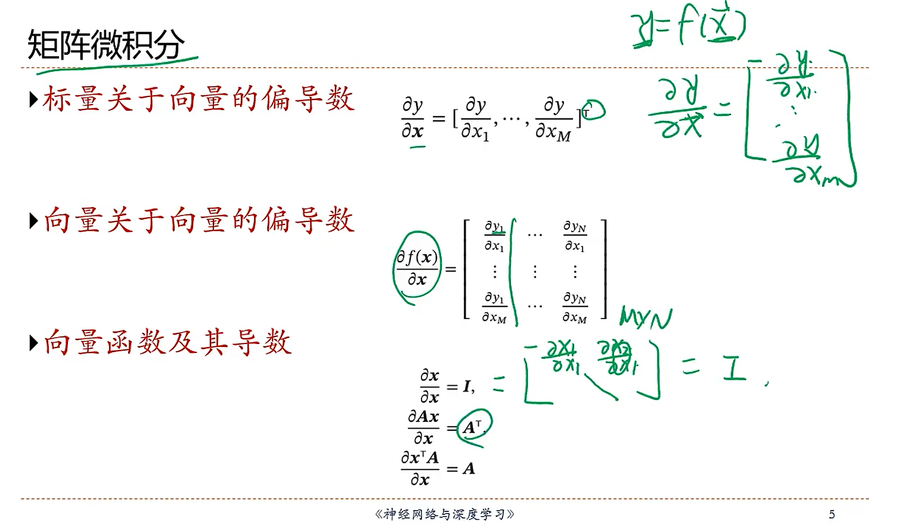

- 最小二乘直接求导为0，使用公式为什么不可行？怎么解决？

因为XXT当X的行数大于列数时，没有逆矩阵。解决方法是：随机梯度下降，或降维。

- 为什么需要降维？

因为特征之间存在共线性，即冗余。

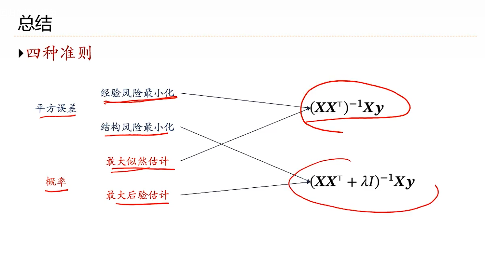

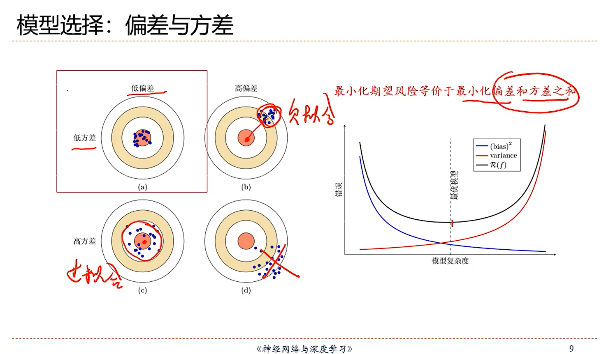

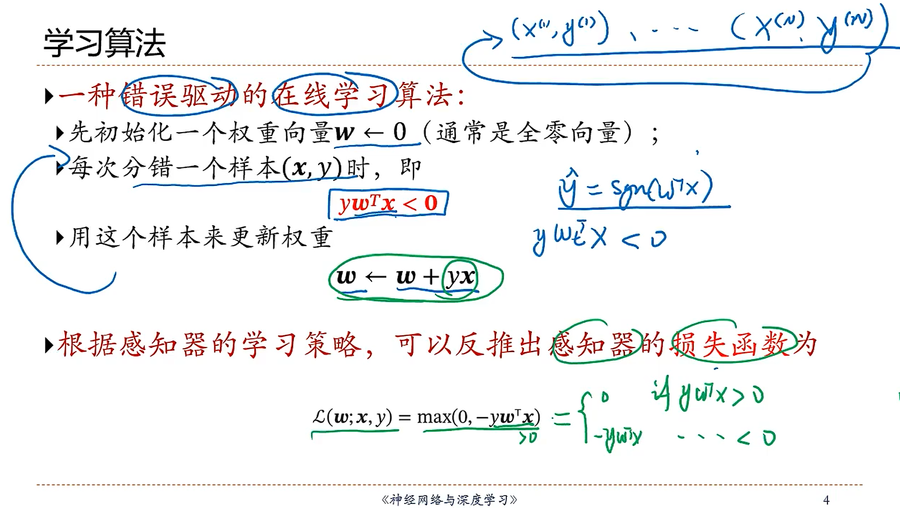

- 当训练采用随机梯度下降时，每次训练需要对训练样本随机排序，因为单个训练，最后的样本对模型影响大。

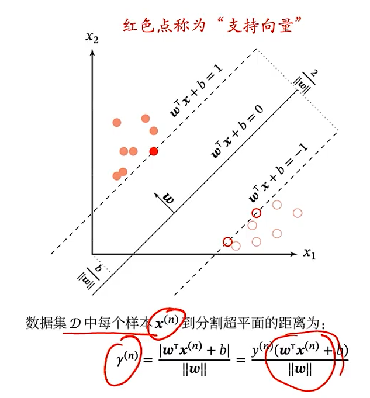

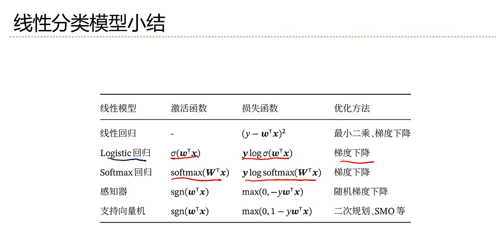

### 神经网络

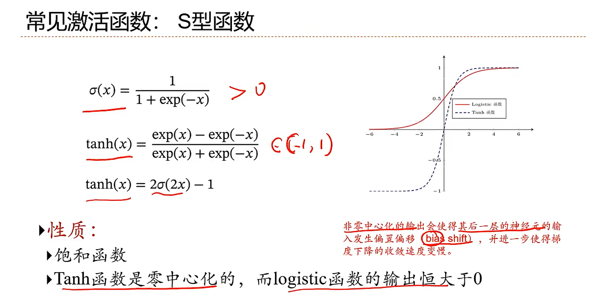

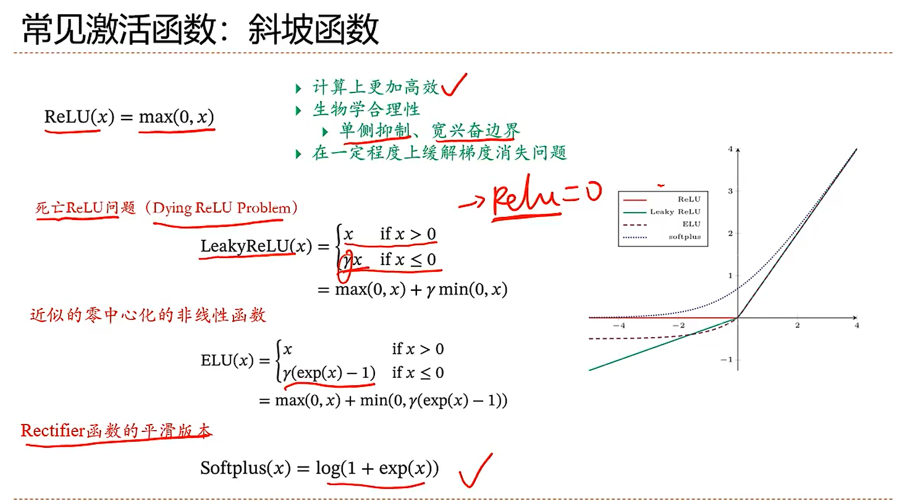

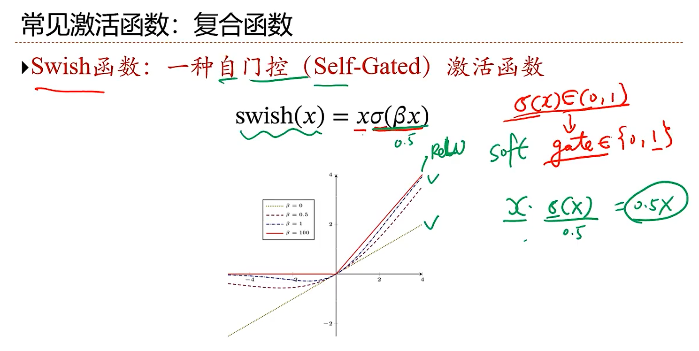

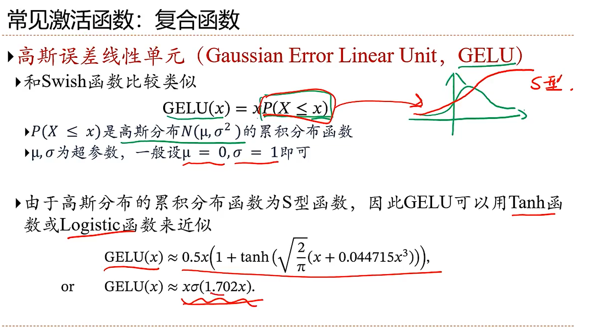

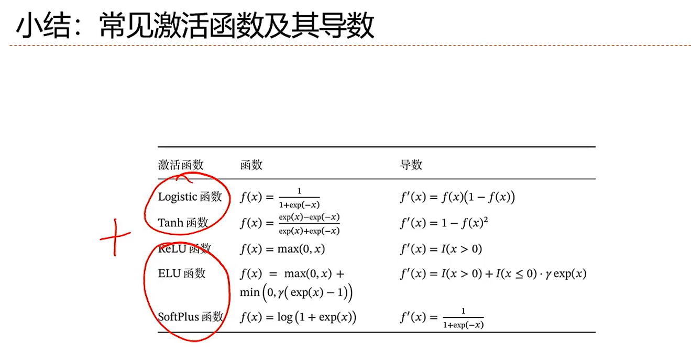


- 矩阵求导的链式法则，是向左连乘

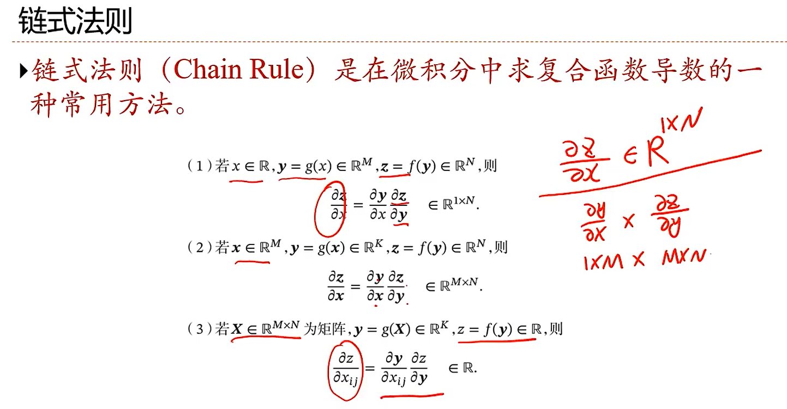

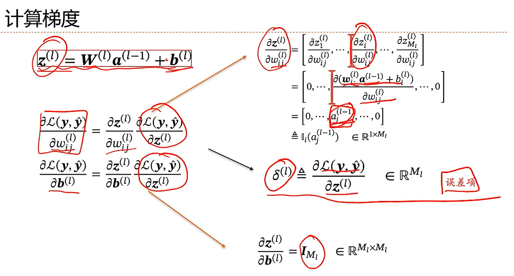

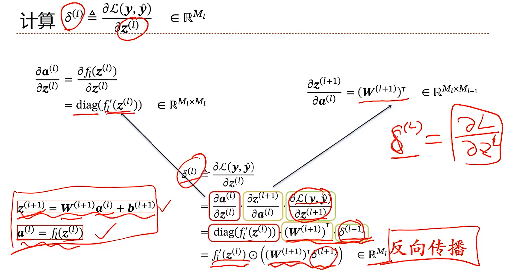

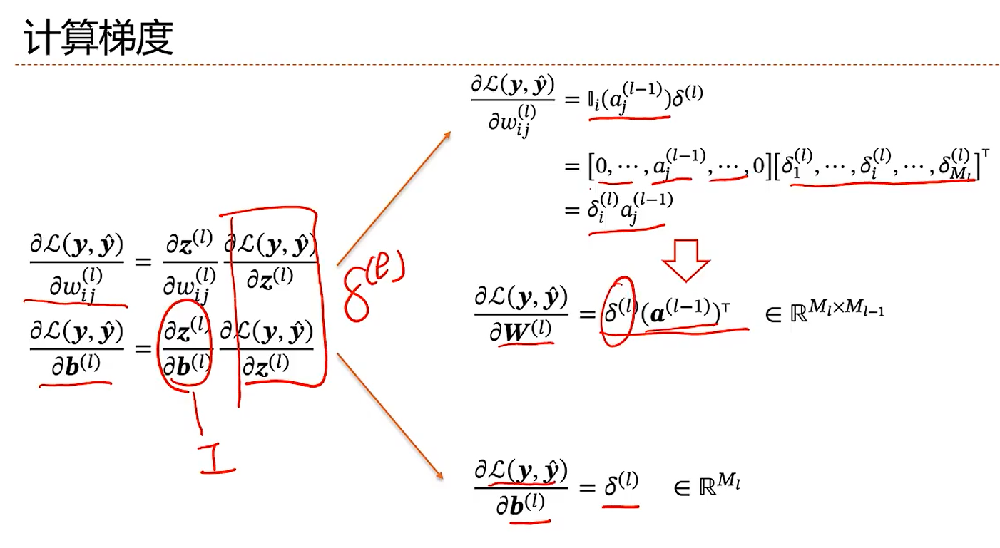

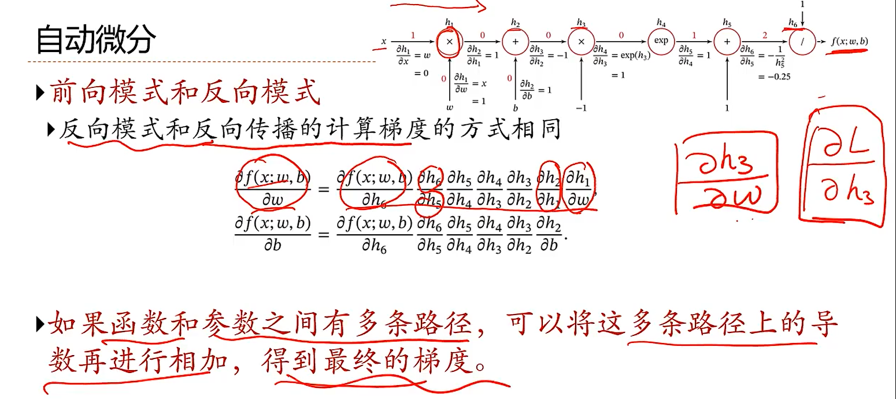

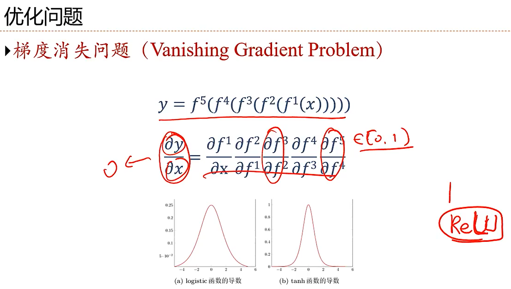

### yolov5🚀⭐✅ 

#### ubuntu和windows下基本环境配置

https://www.bilibili.com/video/BV1fN4y1F7gx?p=5&spm_id_from=pageDriver&vd_source=bc56950f2a20855fef4169a68b4e1764&t=295.7

#### 运行demo

```shell
#安装git下载的包所依赖的其它包
conda activate pytorch
pip install -r requirements.txt -i https//pypi.tuna.tsinghua.edu.cn/simple
```

```shell
#启动，使用摄像头，使用已训练好的模型yolov5x6.pt，IOU阈值设置为0.4
E:\app\Anaconda3\envs\pytorch\python.exe detect.py --source 0 --weights .\weights\yolov5x6.pt --conf 0.4
```


#### 自己训练

首先下载数据集，调用脚本生成yolo训练所需的格式文件夹。

- **指定训练集**

data/下创建文件指定训练集和验证集（复制voc.yaml修改）

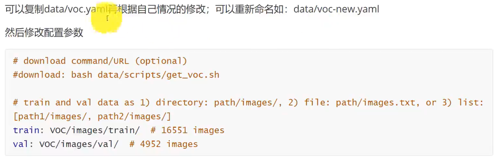

- **指定网络模型**

models/下创建文件指定网络模型（复制修改）

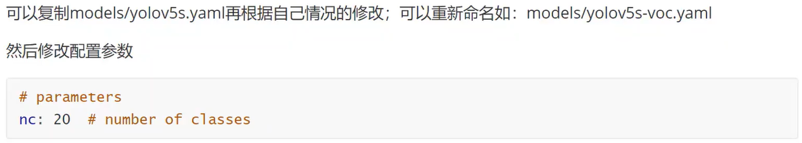

- **开始训练**

```shell
#首先转到对应的python环境下
python train.py --data data/my_voc.yaml -cfg models/my_yolov5s.yaml --weights weights/yolov5s.pt --batch-size 16 --epochs 200
```

- **训练结束**之后，在runs/exp0/里生成：

  - best.pt和last.pt是得到的权重

  - hyp.yaml是训练得到的超参数

  - opt.yaml是训练过程中的配置参数。

- **回顾训练过程**

```shell
# 在训练结束之后，回顾训练过程可视化。（点开它给的url）
tersorboard --logdir=./runs
```


#### 调用自己训练的模型

```shell
#启动，使用摄像头，使用自己训练得到的模型runs/exp0/weights/best.pt，IOU阈值设置为0.4
E:\app\Anaconda3\envs\pytorch\python.exe detect.py --source 0 --weights .\runs\exp0\weights\best.pt --conf 0.4
```

性能统计：

```shell
python test.py --data data/my_voc.yaml --weights .\runs\exp0\weights\best.pt --batch-size 16
# 它会遍历验证集，得到P R mAP等指标
```

