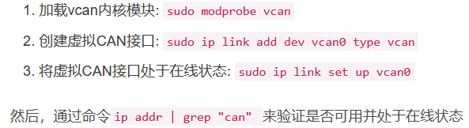
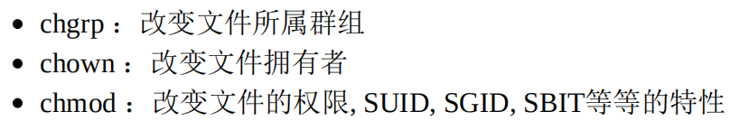
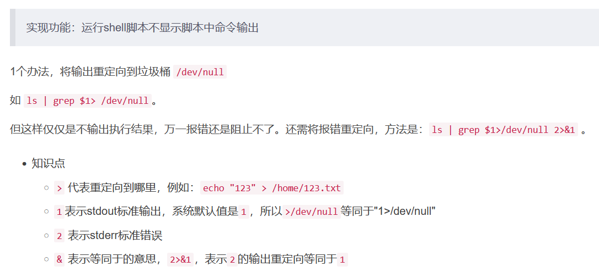
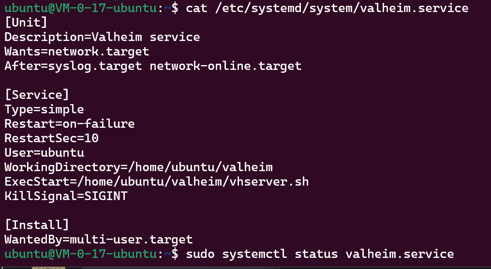

### LINUX加VPN

西部世界VPN（LINUX教程）：https://xbsj9728.website/portal/page/download?client=linux

#### Ubuntu Trojan客户端使用教程

此教程使用的是 Ubuntu 18.04 x64

#### 1. 开启Trojan代理服务

- **使用此命令下载Trojan客户端**

  我已经下载到了本地：/mnt/d/安装包/trojan-1.15.1-linux-amd64.tar.xz

  官方版本(GitHub)：

  ```shell
  cd /usr/src && wget  https://github.com/trojan-gfw/trojan/releases/download/v1.15.1/trojan-1.15.1-linux-amd64.tar.xz
  ```

  备用地址(西部世界VPN提供) ：

  ```shell
  cd /usr/src && wget https://westss.online/download/trojan-1.15.1-linux-amd64.tar.xz
  ```

  **解压Trojan文件**
  `tar xvf trojan-1.15.1-linux-amd64.tar.xz`

- **打开配置文件**
  `cd /usr/src/trojan`
  `vim config.json`

- **按i进入编辑模式**

  run_type 为运行模式，指定填为 "client"

  local_port 为本地端口，如 1080

  remote_addr 为远程服务器地址，填服务器IP，如 "219.22.49.201"

  remote_port 为远程服务器端口，如 22201

  password 修改为 ["123456"]（西部世界节点的密码）

  \* 219.22.49.201、22201、123456 分别为西部世界节点的：服务器IP、端口号、密码，可在「我的节点」页面查看

  \* 示例如下

  ```
      "run_type": "client",
      "local_addr": "0.0.0.0",
      "local_port": 1080,
      "remote_addr": "219.22.49.201",
      "remote_port": 22201,
      "password": ["123456"],
  ```

  ssl中的 sni 为主机SNI名，如 "jpo123.ovod.me"，对应节点内容里的"服务器SNI"

  ssl中的 verify 值修改为 false （如果配置文件中没有，则添加这个配置）

  ssl中的 verify_hostname 值修改为 false （如果配置文件中没有，则添加这个配置）

  ssl中的 cert 修改为 "" （改成空的）

  \* 示例如下

  ```
          "sni": "jpo123.ovod.me",
          "verify": false,
          "verify_hostname": false,
          "cert": "",
  ```

- **按ESC键退出编辑，输入:wq保存配置文件**

- 使用以下命令配置 `trojan service`

  ```
  cat > /etc/systemd/system/trojan.service <<-EOF
  [Unit]
  Description=trojan
  After=network.target
  
  [Service]
  Type=simple
  PIDFile=/usr/src/trojan/trojan.pid
  ExecStart=/usr/src/trojan/trojan -c /usr/src/trojan/config.json -l /usr/src/trojan/trojan.log
  ExecReload=/bin/kill -HUP \$MAINPID
  Restart=on-failure
  RestartSec=1s
  
  [Install]
  WantedBy=multi-user.target
  
  EOF
  ```

- **启动Trojan**
  `systemctl start trojan`

- ​                            **检查是否启动成功**                            
  `ps aux | grep trojan | grep -v grep`                            
  看到有类似 /usr/src/trojan/trojan 的内容展示，即表示trojan正在运行                            
  如果未启动成功，通过这个命令查看日志： cat /usr/src/trojan/trojan.log                            
  还可以执行 `curl ip.sb --socks5 127.0.0.1:1080`, 查看结果是否为Trojan代理的IP                        

- **如何设置为开机启动？**
  使用此命令：`systemctl enable trojan`

------

#### 2. 命令行使用Trojan代理

-  **linux中很多操作是在终端中进行**                            
  很多程序和服务的下载都需要通过 npm, gem, nvm, git等命令进行，而在国内下载速度较差，如果中断还要重新开始，通过全局翻墙可以改善这种情况。                        
- **安装配置proxychains**                            
  全局翻墙通过proxychains实现，即将任何程序和Trojan的proxy建立链接，原理和浏览器的代理相似                            
  下载: `sudo apt-get install proxychains`                            
  配置: `sudo vi /etc/proxychains.conf`                            
  在最后的ProxyList里注释默认的socks代理： socks4 前增加#表示注释                            
  在最后的ProxyList里加入Trojan的代理设置： `socks5    127.0.0.1    1080`                            
  测试本地IP: `curl -4 ip.sb`，将显示自己的IP                            
  测试代理IP: `proxychains curl -4 ip.sb`，将显示Trojan代理的IP                            
  后续使用的命令行需要代理时，只需要在前面加上 `proxychains` 即可                            
  如 `proxychains npm install`                        


### GIT

#### 新建仓库

```shell
mkdir ice_src
cd ice_src/
git init
git remote add origin git@gitee.com:xlzhknight/ice_src.git
git push -u origin "master"
```

#### 已有仓库

```shell
git clone 链接
```

#### 提交

```shell
git add .								#或选择部分文件： git add README.md
git commit -m 'abcdefg'
git push
```

#### 拉取

```shell
git pull
```

#### 强行pull并覆盖本地文件

```sh
git fetch --all  
git reset --hard origin/master 
git pull
```

#### 只有.git本地恢复

```
git fetch --all
git reset --hard master
```

#### 下载子模块

```
git clone --recursive https://github.com/XXX/xxx
#或
git clone https://github.com/XXX/xxx
cd xxx
git submodule update --init
```

\#coding=UTF-8


### windows

```powershell
#查看在当前局域网下的所有设备ip及其MAC地址
arp -a
```


### linux

#### 新建vcan虚拟设备



#### 调试can口

https://blog.csdn.net/weixin_36480576/article/details/116965401

```shell
sudo ifconfig can2 down
sudo ip link set can2 type can bitrate 500000
sudo ifconfig can2 up

cansend can2 123#DEADBEEF

candump can2

rostopic pub /chassis/cmd_vel

ifconfig -a | grep can
```

#### 查看硬件型号信息

- 如果使用的是Windows操作系统，可使用CPU-Z（http://www.cpuid.com/cpuz.php）这套软件，如果是 Linux环境下，可以使“cat /proc/cpuinfo” 及使用“lspci”来查阅各项元件的型号； 

#### 改变文件权限



```
~ywz，表示ywz的目录路径
pwd -P显示真实的路径，针对链接文件下的情况
```

#### 关于可执行文件路径的变量： $PATH

echo $PATH查看可执行文件搜索路径

PATH="${PATH}:/root"	在PATH中新加入搜索路径 

#### cp创建硬链接软连接

cp -a 连权限一起复制

cp -s 源 目标		软连接，符号链接

cp -h 源 目标		硬链接

如果没有加上任何选项时，cp复制的是原始文件，而非链接文件的属性

可以将多个数据一次复制到同一个目录去！最后面一定是目录！ 

在指令前加上反斜线，可以忽略掉 alias 的指定选项

#### 文件内容查阅

cat 由第一行开始显示文件内容 

tac 从最后一行开始显示，可以看出 tac 是 cat 的倒着写！ 

nl 显示的时候，顺道输出行号！ 

more 一页一页的显示文件内容 

less 与 more 类似，但是比 more 更好的是，他可以往前翻页！ 

head 只看头几行 

tail 只看尾巴几行 

od 以二进制的方式读取文件内容！

#### touch更改时间

touch -d "2 days ago" bashrc	更改使用记录时间，为两天前

touch -t 201406150202** bashrc**	更改到指定日期

#### umask修改默认赋予权限

umask 002	默认权限=777减去022

#### chattr隐藏属性

chattr +i 文件	文件不能做任何修改删除，root也不行。

chattr -i 文件	取消i属性 

#### lsattr看隐藏属性

#### /etc/shadow 

Linux 系统中，所有帐号的密码都记录在/etc/shadow 这个文件里面，这个文件的权限为：“---------- 1 root root”，

#### 权限s t

SUID/SGID/SBIT是特殊权限，写在本人、群组、其他人位置时代表意义不同。pdf，P502

4 为 SUID 2 为 SGID 1 为 SBIT，在这权限数字之前再加上这个数字

#### 观察文件类型：file

#### 指令文件名的搜寻

which [-a] command

-a ：将所有由 PATH 目录中可以找到的指令均列出，而不止第一个被找到的指令名称

#### 文件文件名的搜寻

通常 **find** 不很常用的！因为速度慢之外， 也很操硬盘！一般我们都是先使用 **whereis** 或者是 **locate** 来检查，如果真的找不到了，才以 find 来搜寻呦！为什么呢？因为

 whereis 只找系统中某些特定目录下面的文件而已，

locate 则是利用数据库来搜寻文件名，当然两者就相当的快速， 并且没有实际的搜寻硬盘内的文件系统状态，比较省时间啦！

更新 locate 数据库的方法非常简单，直接输入“ **updatedb** ”就可以了

**find [PATH] [option] [action]** 

-mtime n ：n 为数字，意义为在 n 天之前的“一天之内”被更动过内容的文件； 

-mtime +n ：列出在 n 天之前（不含 n 天本身）被更动过内容的文件文件名； 

-mtime -n ：列出在 n 天之内（含 n 天本身）被更动过内容的文件文件名。 

-newer file ：file 为一个存在的文件，列出比 file 还要新的文件文件名

find还能根据权限、所属者等条件进行搜索，功能强大。

**find /usr/bin /usr/sbin -perm /7000 -exec ls -l {} \; **

{} 代表的是“由 find 找到的内容”，-exec 一直到 \; 是关键字，代表 find 额外动作的开始 （-exec） 到结束 （\;）因为“ ; ”在 bash 环境下是有特殊意义的，因此利用反斜线来跳脱


#### uname

uname 是UNIX和类UNIX操作系统命令，用于显示当前操作系统名称。

#### dumpe2fs  xfs_info 

EXT 家族的dumpe2fs 去观察 superblock 内容

xfs_info 挂载点**|**设备文件名

#### 磁盘与目录容量查看

df：列出文件系统的整体磁盘使用量； 

du：评估文件系统的磁盘使用量（常用在推估目录所占容量）

#### 各级子文件夹文件改后缀为md

```bash
find R3A4015200_FRadar_VV5_20211122/ -type d -exec mkdir -p  tmp/{} \;#在tmp文件夹下创建子文件夹
find R3A4015200_FRadar_VV5_20211122/ -type b,c,p,f,l,s -exec touch tmp/{}.md \;#在各级子文件夹下创建同名md文件
```

批量删除带.md的后缀https://blog.csdn.net/weixin_42031299/article/details/121942850

```
find tmp/ -type f -name "*.md" | awk -F ".md" '{print $1}' | xargs -i -t mv ./{}.md ./{}
```

#### 定时自动运行备份脚本

新建一个ywz_backup.sh脚本：

```bash
#! /bin/bash

dirdate=`date +%Y%m%d`_`date +%H%M%S`
mkdir /home/vhserver/.config/unity3d/IronGate/ywz_backup/$dirdate
cp -r /home/vhserver/.config/unity3d/IronGate/Valheim /home/vhserver/.config/unity3d/IronGate/ywz_backup/$dirdate/

#记得touch一下
#2天之前的删除
#find -mtime +1 exec rm -rf {} \;
echo 'backup at time: '$dirdate': done.'
```

将其写入vim /etc/crontab，每周一3点运行一次脚本

```bash
00 03 * * 1 root /home/vhserver/ywz_backup.sh
```

#### shell命令行ssh自动输入密码

```bash
sshpass -p ABCDqwer12 ssh -o StrictHostKeyChecking=no vhserver@175.24.177.201
```

#### shell脚本屏蔽输出

```bash
 apt install sshpass > /dev/null 1> /dev/null 2> /dev/null
```



#### ssh+expect远程执行命令

```bash
#!/usr/bin/expect

set timeout 3
spawn ssh -o StrictHostKeyChecking=no vhserver@175.24.177.201
expect {
    "*yes/no" { send "yes\r"; exp_continue }
    "*password:" { send "ABCDqwer12\r" }
}
expect vhserver@* { send "touch /home/vhserver/ywz_tmp_shell.txt\r" }
#send "/home/vhserver/vhserver restart\n"
expect vhserver@* { send "exit\r" }
interact
```

#### C++获取linux用户名

```
#include <unistd.h>
#include <pwd.h>
getpwuid(getuid())->pw_name
```

#### C++编译加密字符串

```c++
#include "StrEnCode.h"
cout << _c("aaa11") << endl;
cout << ("aaa22") << endl;
```

#### 创建valheim.service并启动



权限是-rw-r--r-- 1 root root

#### 启动简单的http文件托管服务

```shell
cd dir/
python -m http.server
```

然后在浏览器地址栏输入，ip:8000进行访问

